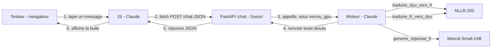

# 🗣️ Djeneba — Fiche technique de la démo


> Démo courte durée : un lien public temporaire, envoyé à quelques testeurs, valable le temps de la session GPU (ex. jusqu'à minuit). Pas de compte, pas de base de données, pas de persistance après la fermeture du notebook.

---

## 🧩 Vue d'ensemble — qui fait quoi

| Bloc | Contenu | Responsable |
|---|---|---|
| 🔧 **Moteur** | Chargement NLLB-200-3.3B + Mistral-Small-3.2-24B, fonctions de traduction/génération |  |
| 🚀 **Lancement** | Serveur uvicorn en thread + tunnel Cloudflare (URL publique) |  |
| ✨ **JavaScript** | Logique du chat côté navigateur (envoi/réception des messages) |  |
| 🐍 **Backend / API** | Route FastAPI `/chat`, appel au moteur, réponse JSON |  |
| 🎨 **HTML / CSS** | Structure de la page, style des bulles de chat |  |

---

## 🔗 Flux de données



**Principe clé : pas de session côté serveur.** L'historique de conversation vit uniquement dans la mémoire JavaScript du navigateur (un tableau), et est renvoyé en entier à chaque requête. Le backend Python n'a donc **aucun état à gérer** — il reçoit l'historique, appelle le moteur, renvoie l'historique mis à jour. Simple, sans cookies, sans dictionnaire de sessions à nettoyer.

---

## 🔧 BLOC MOTEUR — fourni par Claude

Fonctions Python exposées dans le notebook, prêtes à être importées/appelées directement par ta route FastAPI (même processus, pas de réseau entre les deux) :

```python
def traduire_dyu_vers_fr(texte: str) -> str: ...

def generer_reponse_fr(message: str, historique_fr: list[dict]) -> str: ...
    # historique_fr format : [{"role": "user", "content": "..."}, {"role": "assistant", "content": "..."}, ...]
    # (extrait uniquement du champ "francais" de chaque tour — jamais le dioula, Mistral ne le comprend pas)

def traduire_fr_vers_dyu(texte: str) -> str: ...

def repondre(message_dyu: str, historique: list[dict]) -> tuple[str, list[dict]]:
    # historique format : [{"role": "user", "dioula": "...", "francais": "..."}, {"role": "assistant", "dioula": "...", "francais": "..."}, ...]
    # Enchaîne les 3 fonctions ci-dessus, en ne traduisant QUE le nouveau message entrant/sortant
    # (le reste du fil arrive déjà traduit dans les deux langues, pas de re-traduction inutile).
    # Retourne (reponse_en_dioula, historique_mis_a_jour) — historique_mis_a_jour contient les 2 nouveaux tours,
    # chacun avec ses champs "dioula" et "francais" déjà remplis.

verrou_gpu: threading.Lock
    # ⚠️ À utiliser OBLIGATOIREMENT autour de chaque appel à repondre() dans ta route,
    # pour que deux testeurs simultanés ne se marchent pas dessus sur le GPU.
```

---

## ✨ BLOC JAVASCRIPT — fourni par Claude

Le script gère :
- Un tableau `historique` en mémoire navigateur (perdu si la page est rechargée — acceptable pour une démo).
- L'envoi du message au clic / touche Entrée.
- Un `fetch()` en `POST` vers `/chat`.
- L'ajout des bulles de message dans le DOM à la réponse.

**Ce dont le JS a besoin pour s'accrocher à ton HTML** (respecte exactement ces identifiants) :

| Élément HTML attendu | `id` requis | Rôle |
|---|---|---|
| `<div>` conteneur des messages | `chat-messages` | Le JS y ajoute les bulles |
| `<form>` ou `<div>` conteneur du champ | `chat-form` | Capture l'envoi |
| `<input type="text">` | `chat-input` | Le texte tapé par le testeur |
| `<button>` ou submit | `chat-send` | Déclenche l'envoi (optionnel si le form gère Entrée) |

**Classes CSS que le JS ajoutera automatiquement** aux bulles créées (à toi de les styler dans ton CSS) :
- `.message.user` → bulle du testeur
- `.message.assistant` → bulle de la réponse
- `.message.loading` → état "en train de répondre" (ajoutée pendant l'attente, retirée à la réponse)

---

## 🐍 BLOC BACKEND / API — à coder par Sasori

Une seule route à implémenter :

### `POST /chat`

**Reçoit (JSON) :**
```json
{
  "message": "Ani sɔgɔma",
  "historique": [
    {"role": "user", "dioula": "...", "francais": "..."},
    {"role": "assistant", "dioula": "...", "francais": "..."}
  ]
}
```

**Doit faire, dans cet ordre :**
1. Extraire `message` et `historique` du corps de la requête.
2. `with verrou_gpu:` → appeler `repondre(message, historique)`.
3. Renvoyer la réponse.

**Renvoie (JSON) :**
```json
{
  "reponse": "Bonjour",
  "historique": [
    {"role": "user", "dioula": "...", "francais": "..."},
    {"role": "assistant", "dioula": "...", "francais": "..."},
    {"role": "user", "dioula": "Ani sɔgɔma", "francais": "Bonjour"},
    {"role": "assistant", "dioula": "Bonjour", "francais": "Bonjour"}
  ]
}
```

> ⚠️ Le champ `dioula` sert au JS (affichage des bulles), le champ `francais` sert au moteur (contexte pour Mistral). Le backend n'a rien à traduire lui-même — il ne fait que transmettre l'historique tel quel, dans les deux sens, au moteur.

**Doit aussi servir les fichiers statiques** (ta page HTML, ton CSS, le JS de Claude) — route `GET /` qui renvoie `index.html`, et un montage `StaticFiles` pour `/static/` (CSS + JS).

> ⚠️ Pas de logique de session, pas de cookie, pas de base de données à prévoir côté backend — tout l'état circule dans le JSON à chaque requête.

---

## 🎨 BLOC HTML / CSS — à coder par Sasori

**Contraintes obligatoires** (pour que le JS de Claude fonctionne sans modification) :
- Respecter exactement les 4 identifiants du tableau ci-dessus (`chat-messages`, `chat-form`, `chat-input`, `chat-send`).
- Prévoir visuellement les 3 classes de bulles (`.message.user`, `.message.assistant`, `.message.loading`).
- Charger le script JS en fin de `<body>` (`<script src="/static/chat.js"></script>`).

**Libre pour toi :** couleurs, polices, disposition, titre, mise en page — tout le reste du style visuel est entièrement à ta main.

---

## ✅ Prochaine étape

Une fois cette fiche validée, Claude fournit :
1. Le code du **moteur** (cellules notebook).
2. Le fichier **`chat.js`**.
3. Le code de **lancement** (uvicorn + tunnel Cloudflare).

Et Sasori code en parallèle :
1. La route **`/chat`** + le service des fichiers statiques (FastAPI).
2. **`index.html`** + **`style.css`**.
